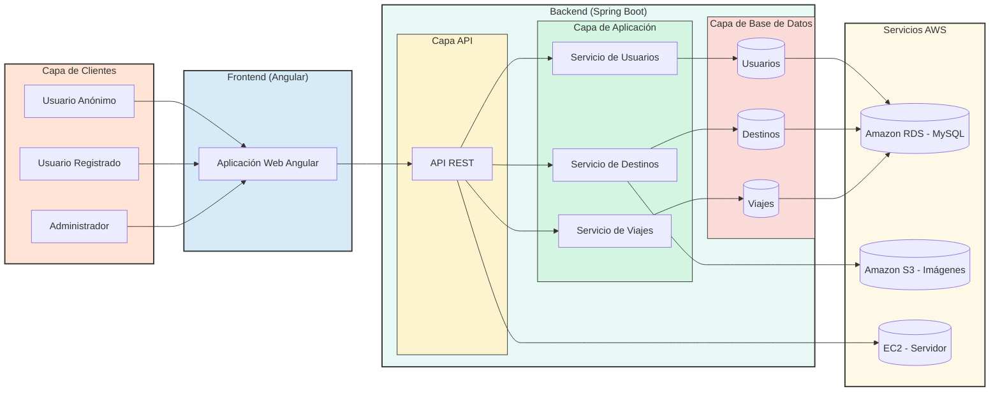
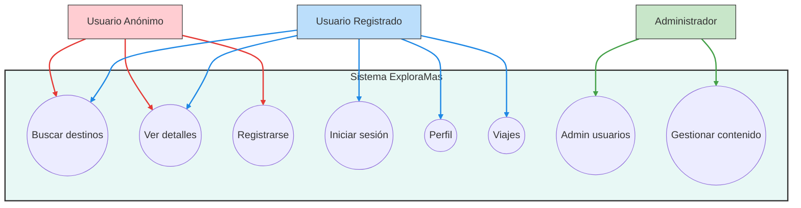
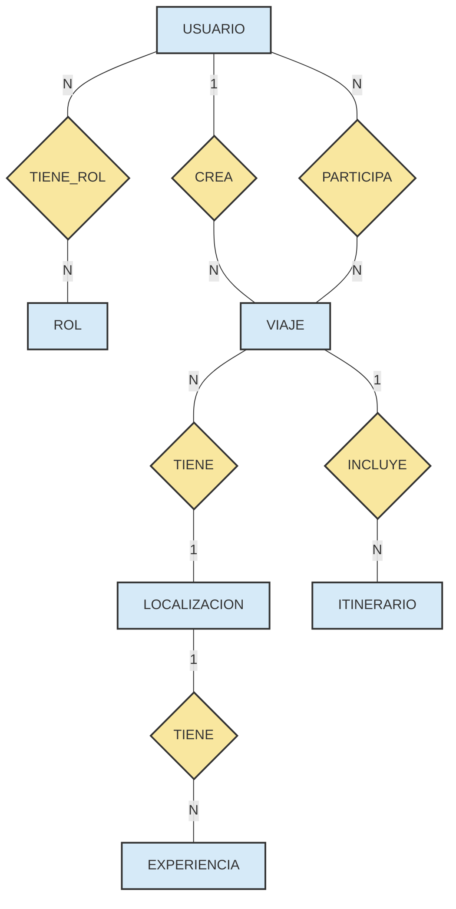
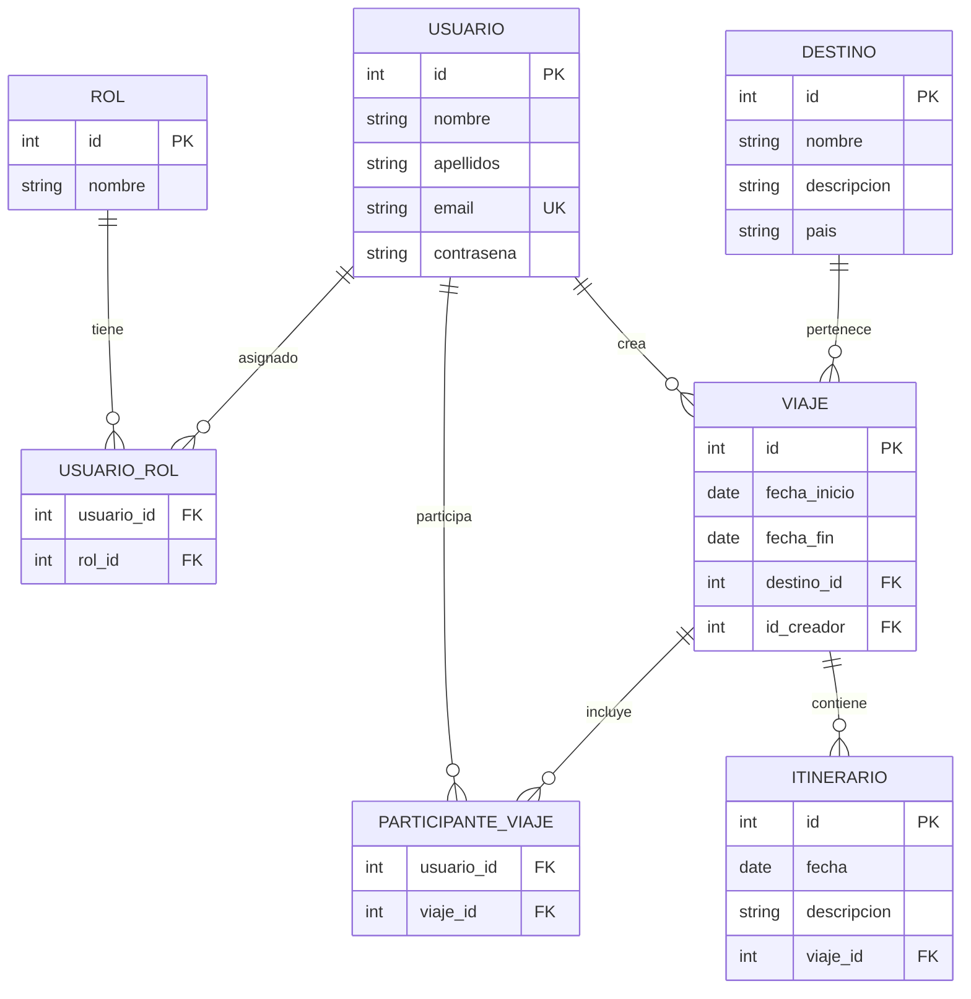

# FASE DE DESEÑO

- [FASE DE DESEÑO](#fase-de-deseño)
  - [1- Diagrama da arquitectura](#1--diagrama-da-arquitectura)
  - [2- Casos de uso](#2--casos-de-uso)
  - [3- Diagrama de Base de Datos](#3--diagrama-de-base-de-datos)
    - [3-1 Modelo entidad/relacion](#3-1-modelo-entidadrelacion)
    - [3-3 Modelo relacional](#3-3-modelo-relacional)
  - [4- Deseño de interface de usuarios](#4--deseño-de-interface-de-usuarios)

## 1- Diagrama da arquitectura

## 2- Casos de uso

## 3- Diagrama de Base de Datos
### 3-1 Modelo entidad/relacion

### 3-3 Modelo relacional

## 4- Deseño de interface de usuarios

[Link a figma](https://www.figma.com/design/uKYEPh0pMD1AgcECwWXYnQ/Explora?m=auto&t=a0tfpmG0vNbS0ALR-1)
>
[**<-Anterior**](../README.md)
